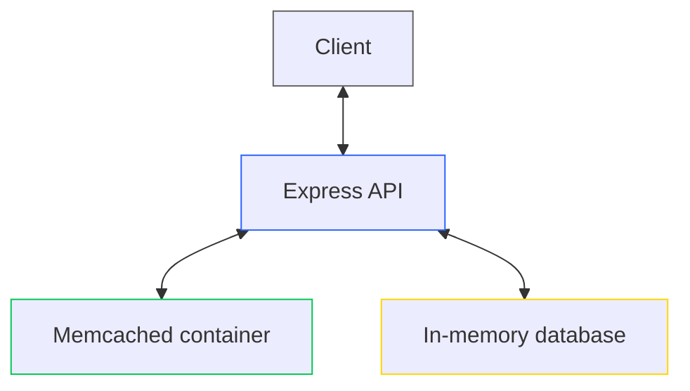

## About project

Projects is example of small Node.js service which acts as API with custom in-memory database and memcached cache. **Feel free to use it as reference or fork it!**

## Installation

Use the npm package manager to install dependencies

```bash
npm i
```

Create docker container with memcached with **default port**

```bash
docker run --name my-memcached -d memcached
```

## Run

```bash
npm run start
```

## How it works

Every time client requests Express API cached endpoint, API searches for cached query in memcached. If it's available it's returned, if not, it's downloaded from artificially slowed in-memory database and cached again in background.

Here's flowchart of process:


